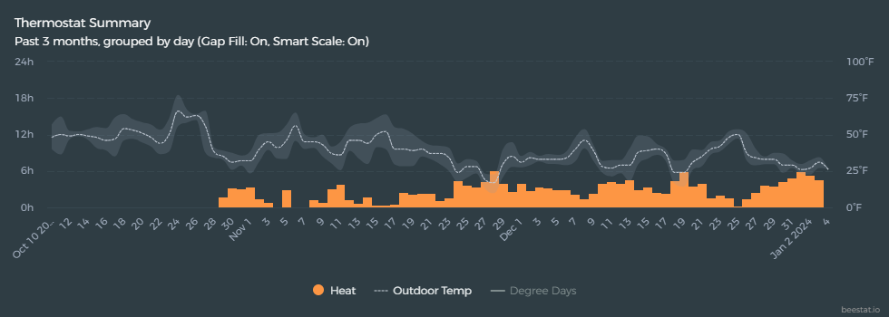


In January 2024, my furnace decided it was done. In the middle of a Wisconsin winter, this is not the kind of surprise anyone wants. What followed was a crash course in HVAC sizing, contractor quotes, and -most interestingly- how data helped me make a smarter decision.


## The Old Furnace is done

In the coldest part of winter, our furnace began to rarely shut off, cycling on and off less frequently than it should. Outside, there was a concerning smell reminiscent of formaldehyde—a chemical odor that was definitely not right. An expert came to inspect it and confirmed that the heat exchanger was likely cracked, a common issue for furnaces of that age.

Fortunately, the unit was limping along just enough to avoid an emergency, giving me time to research I started researching what I needed to know about replacing it, looking into reviews of local contractors and manufacturers, and considering factors like staging and efficiency. This was a typical decision-making process, but I came across several online discussions emphasizing the importance of getting a Manual J calculation done if possible.

It became clear that many contractors often eyeballed the size (in BTU) of a furnace needed for a home, relying on their experience. Often, when replacing a furnace, they would simply replace it with the same size as the old one, which may not always be the best approach.

> Insist that your contractor use the Air Conditioning Contractors of America (ACCA) Manual J to calculate the proper size of heating and cooling equipment.
>
> — US Department of Energy

[This excellent article by Dana Dorsett](https://www.greenbuildingadvisor.com/article/replacing-a-furnace-or-boiler) confirmed my thinking and explains a way of calculating my home's heat load.

> The size of a heating or cooling system will determine not only its ability to heat or cool your home, but also the size of your energy bills. Oversized cooling systems can be noisy, provide inadequate thermal comfort, and lead to mold and poor indoor air quality — while costing too much.
>
> — US Department of Energy

- On days when the outside temperature was 0°F, the old furnace ran about 9 hours out of 24.
- On 25°F days, it ran about 6 hours.

## The Data

## The Options

Here’s a quick summary of the quotes I received:

| Manufacturer | Model          | BTU Rating | AFUE    | Output BTU |
| ------------ | -------------- | ---------- | ------- | ---------: |
| *\*Carrier*  | *58MXA100-16*  | *100,000*  | *93.1%* | *93,100*   |
| Bryant       | Preferred 926T | 100,000    | 96.7%   | 96,700     |
| Lennox       | Elite EL297UHV | 88,000     | 97.0%   | 85,360     |
| Carrier      | 59TP6C         | 80,000     | 96.0%   | 76,800     |

All were high-efficiency, two-stage furnaces, but all were sized much larger than my calculated needs.

## Lessons Learned

1. **Contractors often oversize**: It’s easier for them, but not always best for your comfort or wallet.
2. **Data is your friend**: Thermostat runtime data can help you right-size your equipment.
3. **Don’t be afraid to ask questions**: Challenge the assumptions and do your own math.

In the end, I chose a furnace that was still a bit oversized, but I felt confident in my decision thanks to the data. If you’re facing a similar situation, dig into your own numbers—you might be surprised by what you find!

## Resources

- [Guide to Home Heating and Cooling - US Department of Energy](https://www.energy.gov/sites/prod/files/guide_to_home_heating_cooling.pdf)
- [Old HVAC industry practices are holding us back and costing us money. But we can fix it. - Technology Connections Youtube](https://www.youtube.com/watch?v=DTsQjiPlksA)
- [HVAC Sizing with Beestat - Beestat Forums](https://community.beestat.io/t/hvac-sizing-with-beestat/1007)
- [Replacing a Furnace or Boiler - Green Building Advisor](https://www.greenbuildingadvisor.com/article/replacing-a-furnace-or-boiler)
- [Design Temperature Limits for Residential New Construction - Energy Star](https://www.energystar.gov/partner-resources/residential_new/working/hvac/hvac_designers/design_temp_limits)
